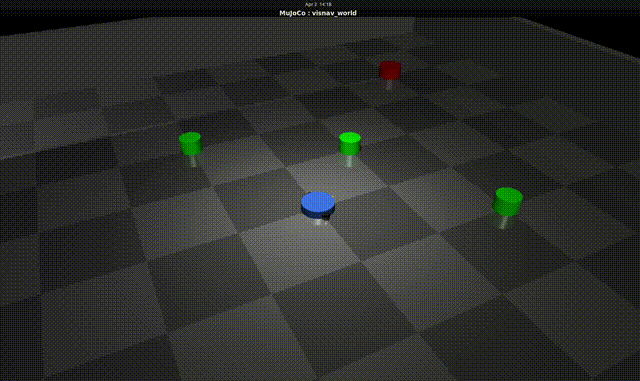

Autonomous Visual Navigation in Uncertain Dynamic Environments




> A differential drive robot navigates to a camera-detected goal in a MuJoCo physics simulation using the ROS2 Nav2 navigation stack — tested under sensor noise and dynamic obstacles.

---

## What This Project Does

VisNav builds a complete **perception-to-control pipeline**:

```
MuJoCo Simulation (physics)
        ↓
ROS2 Bridge Node → /camera/image_raw | /odom | /scan
        ↓
OpenCV Perception Node → detects red goal via HSV thresholding
        ↓
Nav2 Stack → AMCL localization + A* planning + DWA avoidance
        ↓
/cmd_vel → robot moves
```

The system is explicitly designed to evaluate **navigation robustness under uncertainty** — Gaussian sensor noise and Brownian motion obstacles simulate real-world uncertain environments.

---

## Stack

| Tool | Version | Role |
|------|---------|------|
| MuJoCo | 3.5.0 | Physics simulation |
| ROS2 | Humble | Middleware and communication |
| Nav2 | Humble | Path planning and localization |
| OpenCV | 4.13 | Camera-based goal detection |
| Python | 3.10 | Implementation language |

---

## Project Structure

```
VisNav/
├── models/
│   └── world.xml          # MuJoCo environment — robot, obstacles, sensors
├── nodes/
│   ├── bridge_node.py     # MuJoCo ↔ ROS2 translator
│   ├── perception_node.py # OpenCV HSV goal detection (Day 5)
│   └── goal_sender.py     # Nav2 action server interface (Day 4)
├── config/
│   └── nav2_params.yaml   # Nav2 configuration (Day 3)
├── launch/
│   └── nav2.launch.py     # Launch file (Day 3)
└── README.md
```

---

## Environment Design

- **Arena:** 10×10m bounded space with 4 walls
- **Robot:** Differential drive, onboard camera (640×480, 60° FOV) + LiDAR
- **Goal:** Red cylinder at (3,3) — detected via HSV color thresholding
- **Obstacles:** 3 green cylinders moving with Brownian motion v(t+1) = v(t) + N(0,σ²)
- **Lighting:** Single centered source — creates natural lighting gradient (uncertainty)

### Why HSV over RGB?
HSV separates color identity (Hue) from brightness (Value). Gaussian noise affects Value, leaving Hue stable. Red goal detected at H=0-10° regardless of lighting conditions.

---

## Key Technical Concepts

**Differential Drive Kinematics**
```
left_vel  = (linear_x - angular_z × wheel_sep/2) / wheel_radius
right_vel = (linear_x + angular_z × wheel_sep/2) / wheel_radius
```

**Brownian Motion Obstacles**
```
v(t+1) = v(t) + η,   η ~ N(0, σ²)
```
Locally smooth, globally unpredictable — models pedestrians and vehicles.

**Physics Timestep**
100Hz physics prevents tunneling. Camera at 30Hz, odom at 50Hz, LiDAR at 10Hz.

---

## Development Progress

- [x] **Day 1** — MuJoCo world XML (robot, obstacles, camera, LiDAR, actuators)
- [x] **Day 2** — ROS2 bridge node (publishers, subscribers, TF, Brownian motion)
- [ ] **Day 3** — Nav2 bringup (AMCL, costmap, path planning)
- [ ] **Day 4** — Goal navigation via action server
- [ ] **Day 5** — OpenCV perception pipeline
- [ ] **Day 6** — Uncertainty injection and benchmarking
- [ ] **Day 7** — Results, demo, and documentation

---

## Running the Project

### Prerequisites
```bash
# ROS2 Humble + Nav2
sudo apt install ros-humble-nav2-bringup ros-humble-tf2-ros -y

# Python dependencies
pip install mujoco numpy opencv-python
```

### Run Bridge Node
```bash
# Terminal 1
source /opt/ros/humble/setup.bash
source ~/visenv/bin/activate
cd ~/visnav_ws/visnav
python3 nodes/bridge_node.py

# Terminal 2 — verify topics
source /opt/ros/humble/setup.bash
ros2 topic list
```

Expected topics:
```
/camera/image_raw
/odom
/scan
/tf
/cmd_vel
```

---

## Results (Planned — Day 7)

Navigation success rate will be evaluated across 5 noise levels:

| Noise Level | Sigma | Episodes | Success Rate |
|-------------|-------|----------|--------------|
| Clean | 0.0 | 20 | TBD |
| Low | 0.1 | 20 | TBD |
| Medium | 0.3 | 20 | TBD |
| High | 0.5 | 20 | TBD |
| Extreme | 0.8 | 20 | TBD |


---

*Built as a personal project during MS Semester 2 — February 2026 onwards*


